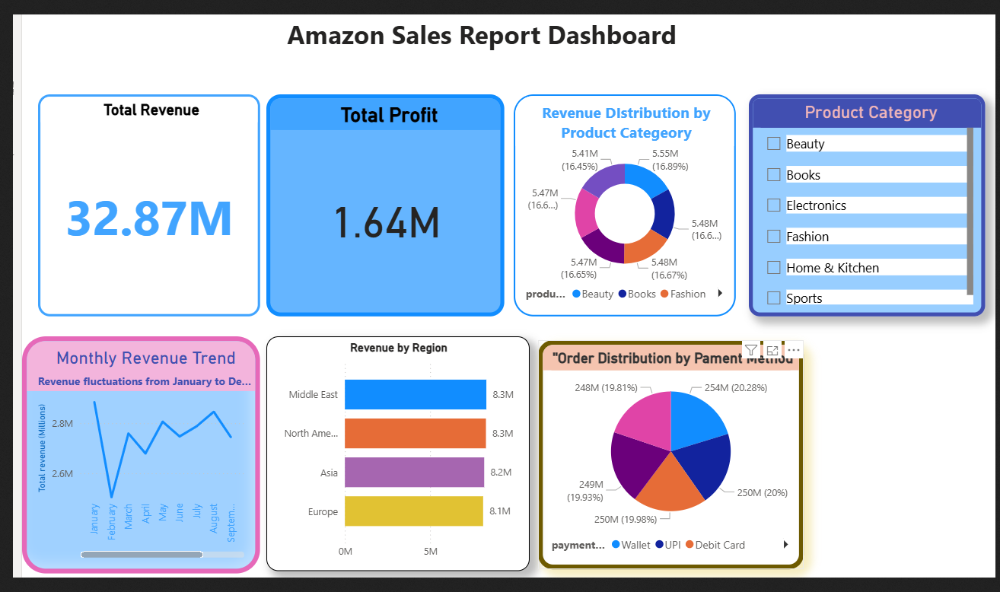

# 📊 Data Analyst Portfolio

Welcome to my portfolio! I specialize in data visualization and business intelligence.

---

## 🛒 [Amazon Sales Analysis](https://github.com/Litonislam-DA/Litonislam-DA)
To me  
Liton Islam 
litonislamnext@gmail.com.

*Analyzed sales performance and revenue trends.*

  

🛒 Amazon Sales Performance & Revenue Insights
​📝 Project Overview

​This project features a comprehensive Amazon Sales Report Dashboard built with Power BI. The goal is to analyze sales efficiency, profit margins, and regional performance to identify key revenue drivers and optimize product category strategies.
​🚀 Key Features

    ​Revenue & Profit Tracking: Real-time monitoring of Total Revenue ($32.87M) and Total Profit ($1.64M).
    ​Regional Performance: Breaking down sales across Middle East, North America, Asia, and Europe.
    ​Product Category Analysis: Analyzing sales distribution across segments like Beauty, Books, Electronics, and Fashion.
    ​Payment Method Trends: Insights into customer preferences across Wallet, UPI, and Debit Cards.

​🛠️ Tools Used

    ​Power BI: For interactive data visualization and report generation.
    ​DAX: To calculate complex measures like profit margins and regional totals.
    ​Data Source: Amazon Sales dataset.

​🔍 Key Insights from Dashboard

    ​💰 High Volume Sales: The total revenue has reached a significant milestone of $32.87M, showcasing high market penetration.
    ​📈 Monthly Trends: Revenue fluctuations from January to December reveal seasonal shopping peaks.
    ​🌍 Regional Leader: The Middle East and North America emerge as top-performing regions for sales volume.
    ​💳 Payment Habits: Customer orders are almost equally distributed among payment methods, with UPI and Debit Cards being highly popular.

​

## 🚀 Check my Analysis on Kaggle
https://www.kaggle.com/code/litonislam/amazon-sales-revenue-data-visualisation

---

## 🛍️ [E-Commerce Customer Churn Analysis](https://github.com/Litonislam-DA/E-Commerce-Customer-Churn-Analysis)
*Identifying customer churn patterns to improve retention.*
To me  
Liton Islam 
litonislamnext@gmail.com

  

🛒 E-commerce Customer Churn & Retention Analysis
​📝 Project Overview

​This project focuses on a deep-dive analysis of customer behavior within an e-commerce platform. Using Python (Pandas, Matplotlib, Seaborn), I analyzed churn patterns to understand why customers leave and what factors contribute to long-term loyalty. This data-driven approach helps in designing strategic retention campaigns to minimize churn and maximize customer lifetime value.
​🚀 Key Features

    ​Global Retention Status: Visualizing the health of the customer base with a 71.1% Active vs. 28.9% Churned ratio.
    ​Geographical Churn Distribution: Identifying churn hotspots across countries like USA, UK, France, and Canada to highlight regional performance.
    ​Demographic Insights: Analyzing churn probability based on Customer Age and Gender-based Loyalty Metrics.
    ​Churn Probability Mapping: Using distribution plots to identify the specific age groups most likely to churn.

​🛠️ Tools Used

    ​Python: For data manipulation and complex Exploratory Data Analysis (EDA).
    ​Libraries: Pandas, Matplotlib, and Seaborn for advanced data visualization.
    ​Jupyter Notebook: Kaggle environment for coding and analysis.

​🔍 Key Insights from Analysis

    ​📉 Churn Rate: A 28.9% churn rate indicates a need for targeted re-engagement strategies for nearly one-third of the customer base.
    ​🌍 Market Trends: The USA shows the highest volume of both active and churned customers, making it a critical market for retention efforts.
    ​👥 Gender Loyalty: Analyzing loyalty metrics by gender shows distinct patterns in how male and female customers engage with the platform.
    ​🎂 Age Factor: Churn probability is most volatile in the mid-age segments, suggesting that lifestyle changes may influence purchasing habits.

 
## 🚀 Check my Analysis on Kaggle
You can find the full datasets and detailed Python notebooks here:
* 📓 [View my Kaggle Notebooks](https://www.kaggle.com/litonislam)
* 📊 [Explore my Datasets](https://www.kaggle.com/litonislam)

	

---

## 📊 Employee Attrition & Retention Dashboard

Analyzed employee data to identify key trends in attrition and retention to drive data-HR decision
To me  
Liton Islam 
litonislamnext@gmail.com
​ 

📊 Project Overview: Employee Attrition & Retention Analysis

​This project presents a data-driven exploration of workforce dynamics, focusing on identifying key factors behind employee turnover and retention. Using Power BI, I transformed raw HR data into an interactive dashboard to help organizations make informed decisions to improve employee satisfaction and reduce attrition.
​🎯 Key Analytical Focus:

    ​Workforce Overview: Monitoring a total headcount of 1,470 employees with an attrition count of 237, resulting in an overall retention rate of 83.88%.
    ​Attrition by Department: Identifying that the Research & Development department faces the highest turnover compared to Sales and HR units.
    ​Demographic & Behavioral Insights: Analyzing the correlation between Age, Gender (60% Male vs. 40% Female), and Overtime commitment on employee exit patterns.
    ​Satisfaction Metrics: Evaluating how Job Satisfaction Ratings directly impact an employee's decision to stay or leave the organization.

​🛠️ Tools Used:

    ​Power BI: For advanced data visualization and dashboarding.
    ​Python (Pandas, Seaborn): For initial Data Cleaning and Exploratory Data Analysis (EDA).

    
## 🚀 Check my Analysis on Kaggle
https://www.kaggle.com/code/litonislam/hr-analytics-dashboard

to me
Liton Islam <litonislamnext@gmail.com>

​📊 Netflix Content Strategy & Insights Dashboard

​📝 Project Overview

​This project provides a comprehensive data-driven analysis of Netflix's content catalog. Using Power BI, the dashboard explores trends in content types, genres, audience ratings, and release patterns to understand Netflix's evolving global content strategy.
​🚀 Key Features

    ​Content Mix Analysis: A detailed breakdown of the Movies (67.43%) vs. TV Shows (32.51%) ratio.
    ​Geographical Insights: Visualizing content production by top-performing countries like the USA, India, and UK.
    ​Rating Segmentation: Classification of the library based on audience age ratings (TV-MA, TV-14, etc.).
    ​Release Timeline: Tracking the exponential growth of content volume since 2015.

​🛠️ Tools Used

    ​Power BI: For data cleaning, modeling, and interactive visualization.
    ​DAX: For creating custom measures and data aggregations.
    ​Dataset: Netflix Movies and TV Shows dataset.

​🔍 Key Insights

    ​🎬 Content Variety: Netflix focuses more on Movies than TV Shows.
    ​🌍 Global Leaders: The United States leads in production, followed significantly by India.
    ​📈 Streaming Boom: A massive surge in content additions is visible after 2015.
    ​🔞 Target Audience: A heavy focus on mature audiences, as indicated by the high volume of TV-MA rated content.
   🚀 Check my Analysis on Kaggle
 * 📊 https://www.kaggle.com/code/litonislam/netflix-data-analysis-trends-insights

	

 
 
### 📊 Supply Chain Data Visualization
to me
 Liton Islam <litonislamnext@gmail.com>

  

This project provides a comprehensive analysis of supply chain operations, including inventory, shipping costs, and lead time metrics.

* **Tech Stack:** Python (Pandas, Matplotlib, Seaborn)
* **Key Features:** Revenue analysis, Logistics optimization, Transport mode comparison.

   🚀 Check my Analysis on Kaggle
[https://www.kaggle.com/code/litonislam/supply-chain-data-visualization]()

